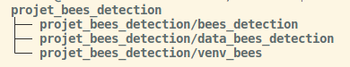
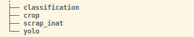
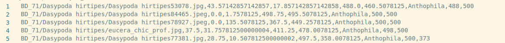

<h1 align="center">Anthophila</h3>


<!-- ABOUT THE PROJECT -->
## About the project
Anthophila ensures the automatic detection and classification of bees by Deep Learning.
Here we developed an algorithm based on YOLOv2 and ResNet50.

The process is divided in 4 phases : 


<div style="text-align: center;">
  
</div>


<!-- GETTING STARTED -->
# Getting Started


## Folder organization
We recommend you to get the data folder and venv folder nearby in a similar organization :

<div style="text-align: center;">
  
</div>

Within this repository you will find : 

- Notebooks : Notebooks used to prepare data and train algorithms
- src : main codes
- datafiles : all the data which is not images (csv, weights, config ..)

Note that the structure of src & datafiles is the same, following this structure : 


<div style="text-align: center;">
  
</div>


## Prerequisites
Depending on your OS, GPU and Drivers, you will need a custom install to use this algorithm. With at least:
* python3
* numpy
* pandas
* keras
* sklearn
* tensorflow
* bbaug

See requirements for more infos.

## Virtual environment
You may want to use a virtual environment (see [venv documentation](https://docs.python.org/3/library/venv.html)).
```
cd projet_bees_detection
python3 -m venv venv_bees_detection
source venv_bees_detection/bin/activate (Linux)
# optionnal: (depending on your hardware) 
# pip install -r requirements.txt

```

<!-- HOW IT WORK -->
# How it works


## 1. Scrap Inaturalist


See [How to scrap iNaturalist ?](./datafiles/scrap_inat/download_inaturalist.md)


## 2. Detection and crop : see this [notebook](./Notebooks/1_detections_train_and_predict.ipynb) for more precise informations.

The data used to train YOLO algorithm should be in a csv with following structure : 

- #database/label/img_1.jpg #bbox_xmin #bbox_xmin #bbox_ymin #bbox_xmax #bbox_ymax #label #img_w # img_h

<div style="text-align: center;">
  
</div>

You can modify the parameters of yolo's training by editing a config file in this [folder](datafiles/yolo/configs). 

If you want to generate anchor boxes you can run : 
```

python3 src/yolo/utils/gen_anchors.py -c path/to/your/config/file -a desired_nb_of_anchors

```

And report the result in your config file in model["anchors].


Then you can run -after having modified your config file :

- to train model on training set:

```

python3 src/yolo/train.py  -c path/to/your/config/file

```

- to evaluate model on test set:

```
python3 src/yolo/evaluate.py  -c path/to/your/config/file -w path/to/saved/weights

```

- to make predictions:


```

python3 src/yolo/predict.py  -c path/to/your/config/file -w path/to/saved/weights -i path/to/input -o output_mode

```

By default, --output mode is set to 'csv_input' which inputs a csv with coordinates of detected bouding boxes saved in this [folder](datafiles/crop/predict_csv)

## 3. Crop

To crop images around bouding boxes you can run : 

```

python3 scr/crop_from_csv.py -c path/to/csv/with/predictions -t folder/where/cropped/images/will/be/stored
-s folder/where/raw/images/are/stored 

```

## 4. Classification 

Check [here](./Notebooks/benchmark_classif/) for more details.


